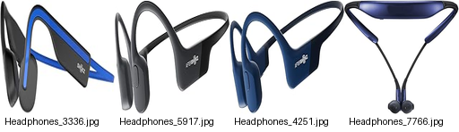
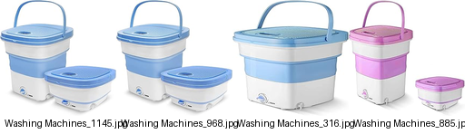
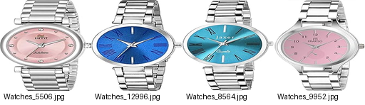

# Image Recommendation Pipeline

This repository provides a simple pipeline to download images from CSV data, organize and split them, train a feature extraction model, and generate visual clusters based on feature similarity.

## Directory Structure

* `databases/`
  CSV files per category, each containing a column `image` with URLs.
* `dataset/raw/`
  Downloaded images organized by category (created by **download-images.py**).
* `dataset/{train,val,test}/`
  Split datasets generated by **process-images.py**.
* `models/`
  Saved training weights (e.g., `best_model.pth`, created by **train-model.py**).
* `recs/`
  Recommended-image mosaics per category, created by **cluster-images.py**.

## Prerequisites

Install required Python packages:

```bash
pip install -r requirements.txt
```

## 1. Download Step

**Script:** `download-images.py`
Reads all CSV files in `databases/`, downloads each image URL, and saves into `dataset/raw/<category>/`. Handles HTTP errors and skips invalid URLs.

**Usage:**

```bash
python download-images.py
```

## 2. Processing Step

**Script:** `process-images.py`
Counts images in `dataset/raw/`, creates split directories (`train`, `val`, `test`) under `dataset/`, and moves images into each split according to specified ratios (default: 70% train, 15% val, 15% test).

**Usage:**

```bash
python process-images.py
```

## 3. Training Step

**Script:** `train-model.py`
Loads `dataset/train` and `dataset/val`, initializes a ResNet-50 backbone (pre-trained on ImageNet), replaces the final FC layer for your number of classes, trains with Adam and CrossEntropyLoss, uses a learning rate scheduler and early stopping, and saves the best weights to `models/best_model.pth`.

**Usage:**

```bash
python train-model.py
```

## 4. Clustering Step

**Script:** `cluster-images.py`
Extracts feature vectors for all images using the trained ResNet-50 (removing the final FC), computes pairwise cosine similarity, selects one random query image per category from `dataset/test`, and generates a mosaic image showing the query and its top 3 most similar images. Mosaics are saved to `recs/<category>_recs.png`.

**Usage:**

```bash
python cluster-images.py
```
---
<h3>Examples</h3>
First image (left) is the query input; the next three are recommended similar items.

Headphones



Televisions


Washing Machines



Watches


